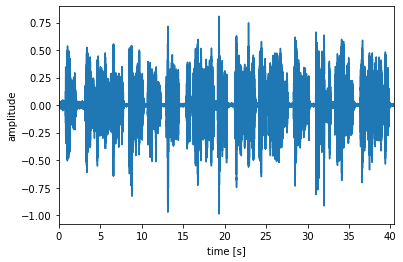

# wav-converter
# Resample wav files easily with just a few lines of code 

  

The script loops through an Input directory, reads wav file with 44 kHz with **librosa**, prints filename and new sample rate (fs) and save wav file with **soundfile** in the Output dir as mono wav file with 16 kHz and 16 bit linear quantization.

Extra step: Normalize wav file to peak amplitude with **pydub**.
You can also do a simple plot reading the wav file with **Parselmouth**, which is a Praat library in Python.
